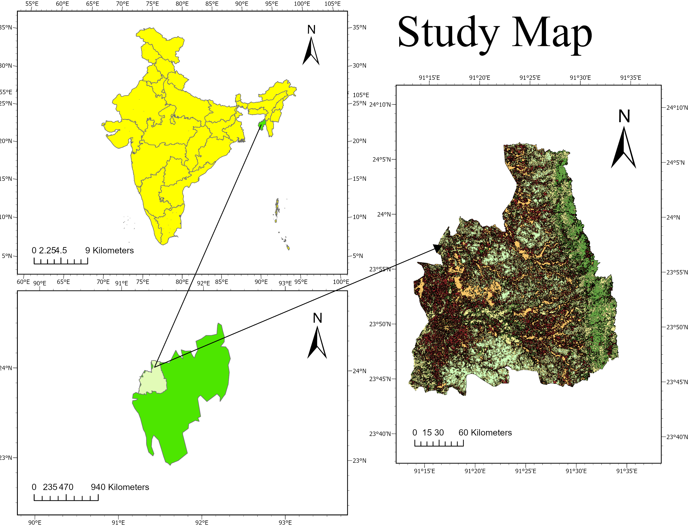

# GIS-Based Land Use Land Cover (LULC) Analysis - West Tripura

##  Overview
This project analyzes land use and land cover changes in West Tripura District from 1990 to 2025 using Remote Sensing and GIS techniques.

##  Tools & Technologies
- ArcGIS Pro
- Landsat Satellite Data
- NDBI (Normalized Difference Built-up Index)

##  Key Findings
- Built-up area increased by 232%
- Forest cover decreased by 34%
- Vegetation declined significantly due to urban expansion

##  Maps
### LULC_1990 VS LULC_2025

### Study Area

##  Conclusion
Rapid urbanization has significantly impacted natural land cover in West Tripura, highlighting the need for sustainable planning.

## 📎 Author
Arghadwip Ghosh